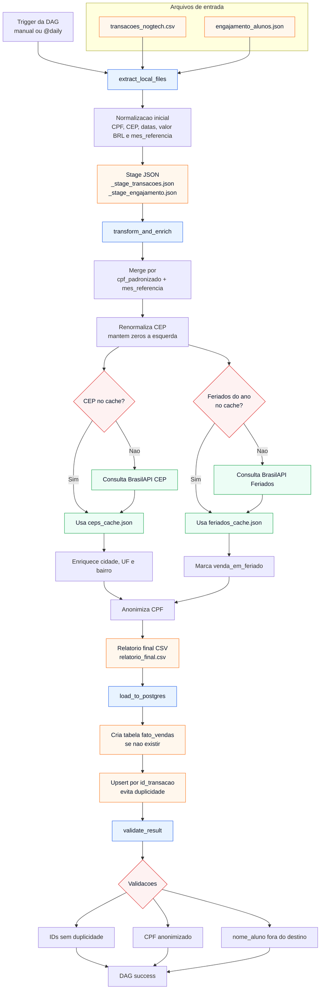

# Grafico da ETL NogTech

```mermaid
flowchart TD
    A["Trigger da DAG<br/>manual ou @daily"] --> B["extract_local_files"]

    subgraph Entrada["Arquivos de entrada"]
        C["transacoes_nogtech.csv"]
        D["engajamento_alunos.json"]
    end

    C --> B
    D --> B

    B --> E["Normalizacao inicial<br/>CPF, CEP, datas, valor BRL e mes_referencia"]
    E --> F["Stage JSON<br/>_stage_transacoes.json<br/>_stage_engajamento.json"]

    F --> G["transform_and_enrich"]
    G --> H["Merge por<br/>cpf_padronizado + mes_referencia"]
    H --> I["Renormaliza CEP<br/>mantem zeros a esquerda"]

    I --> J{"CEP no cache?"}
    J -- "Sim" --> K["Usa ceps_cache.json"]
    J -- "Nao" --> L["Consulta BrasilAPI CEP"]
    L --> K

    I --> M{"Feriados do ano<br/>no cache?"}
    M -- "Sim" --> N["Usa feriados_cache.json"]
    M -- "Nao" --> O["Consulta BrasilAPI Feriados"]
    O --> N

    K --> P["Enriquece cidade, UF e bairro"]
    N --> Q["Marca venda_em_feriado"]
    P --> R["Anonimiza CPF"]
    Q --> R
    R --> S["Relatorio final CSV<br/>relatorio_final.csv"]

    S --> T["load_to_postgres"]
    T --> U["Cria tabela fato_vendas<br/>se nao existir"]
    U --> V["Upsert por id_transacao<br/>evita duplicidade"]

    V --> W["validate_result"]
    W --> X{"Validacoes"}
    X --> Y["IDs sem duplicidade"]
    X --> Z["CPF anonimizado"]
    X --> AA["nome_aluno fora do destino"]

    Y --> AB["DAG success"]
    Z --> AB
    AA --> AB

    classDef task fill:#e8f3ff,stroke:#2563eb,stroke-width:1px,color:#0f172a;
    classDef data fill:#fff7ed,stroke:#f97316,stroke-width:1px,color:#0f172a;
    classDef external fill:#ecfdf5,stroke:#16a34a,stroke-width:1px,color:#0f172a;
    classDef check fill:#fef2f2,stroke:#dc2626,stroke-width:1px,color:#0f172a;

    class B,G,T,W task;
    class C,D,F,S,U,V data;
    class L,O,K,N external;
    class J,M,X check;
```

