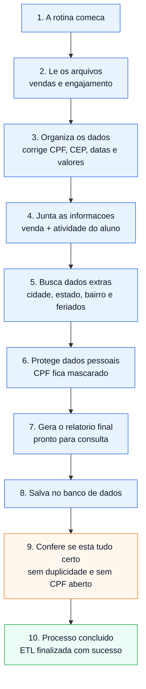

# Grafico simples da ETL NogTech

```mermaid
flowchart TD
    A["1. A rotina comeca"] --> B["2. Le os arquivos<br/>vendas e engajamento"]
    B --> C["3. Organiza os dados<br/>corrige CPF, CEP, datas e valores"]
    C --> D["4. Junta as informacoes<br/>venda + atividade do aluno"]
    D --> E["5. Busca dados extras<br/>cidade, estado, bairro e feriados"]
    E --> F["6. Protege dados pessoais<br/>CPF fica mascarado"]
    F --> G["7. Gera o relatorio final<br/>pronto para consulta"]
    G --> H["8. Salva no banco de dados"]
    H --> I["9. Confere se esta tudo certo<br/>sem duplicidade e sem CPF aberto"]
    I --> J["10. Processo concluido<br/>ETL finalizada com sucesso"]

    classDef task fill:#e8f3ff,stroke:#2563eb,stroke-width:1px,color:#0f172a;
    classDef important fill:#ecfdf5,stroke:#16a34a,stroke-width:1px,color:#0f172a;
    classDef check fill:#fff7ed,stroke:#f97316,stroke-width:1px,color:#0f172a;

    class A,B,C,D,E,F,G,H task;
    class I check;
    class J important;
```
